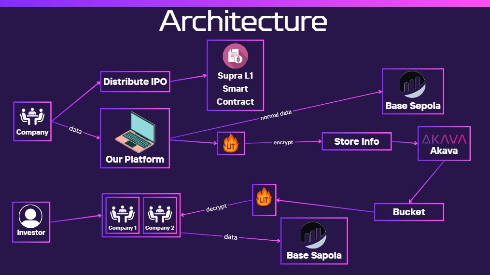

# 🌟 **EquiChain**  
### 🚀 *Dynamic Initial Public Offering (IPO) Allocations in Web3*

---

  

---

## 📋 **Table of Contents**  
1. [Overview](#overview)  
2. [Problem Solved](#problem-solved)  
3. [Key Features](#key-features)  
4. [Challenges Faced](#challenges-faced)  
5. [Tech Stack](#tech-stack)  
6. [Getting Started](#getting-started)  
   - [Prerequisites](#prerequisites)  
   - [Steps to Set Up](#steps-to-set-up)  
7. [Troubleshooting](#troubleshooting)  
8. [License](#license)  

---

## 🌍 **Overview**  
EquiChain revolutionizes the traditional IPO process by leveraging **blockchain technology** to make allocations **transparent**, **secure**, and **fair**. No more favoritism toward institutional investors—EquiChain levels the playing field for everyone.  

---

## 💡 **Problem Solved**  
The traditional IPO allocation systems are:  
- ❌ Manual and Opaque  
- ❌ Prone to Bias (favoring institutions)  
- ❌ Discouraging for Retail Investors  

### **EquiChain's Solutions:**  
- ✅ Uses *randomized allocation* for fairness.  
- ✅ Offers *transparent processes* through decentralized protocols.  
- ✅ Simplifies participation for retail investors.  

---

## 🔑 **Key Features**  
✨ **Randomized Allocation:** Ensures fairness with *Supra L1 DVRF*.  
🔒 **Secure File Management:** Leverages *Lit Protocol* for data encryption.  
⚡ **Seamless Transactions:** Integrates with *Coinbase* for smooth payments.  
🧩 **User-Friendly Onboarding:** Simplifies registration via *Octa* and *CoinDCX*.  
📁 **Decentralized Storage:** Uses *Akaave* for secure and reliable data storage.  
🔍 **Full Transparency:** Verifiable and visible allocation processes.  

---

## 🚧 **Challenges Faced**  
1. 🕒 **Supra Whitelisting:** Delays in implementing DVRF features.  
2. 🔗 **Lit Protocol Conflicts:** Dependency issues during integration.  
3. 📜 **Inter-Smart Contract Communication:** Required creating a custom cryptocurrency.  
4. 🔤 **Naming Discrepancies:** Confusions between *Supra* and *Aptos Move*.  

---

## 🏗 **Project Architecture**  

Below is the architecture of the EquiChain project that demonstrates the interaction between different components:




## 🛠 **Tech Stack**  
| Technology          | Role in Project                | Documentation Link                                    |  
|---------------------|--------------------------------|-----------------------------------------------------|  
| **Supra L1**        | Blockchain Network            | [Supra Docs](https://docs.supra.com/)               |  
| **Lit Protocol**    | File Encryption/Decryption    | [Lit Docs](https://www.litprotocol.com/)            |  
| **Coinbase**        | Payment Gateway               | [Coinbase API Docs](https://docs.cdp.coinbase.com/) |  
| **Okto CoinDCX**    | User Registration             | [Okto API Docs](https://coindcx.com/api/help/)      |  
| **Akaave**          | Decentralized Data Storage    | [Akaave Docs](https://docs.akave.ai/)               |  

---

## 📖 **Getting Started**  

### 🔑 **Prerequisites**  
- 🛠 Install **Node.js** (v14 or higher).  
- 💰 Set up accounts for **Coinbase** and **OcktoFX**.  
- 🔒 Configure **Lit Protocol** and **Akaave** credentials.  

---

### 🚀 **Steps to Set Up**

#### **1. Clone the Repository**  
```bash  
git clone https://github.com/MrDurvesh11/WebWeavers_ETHIndia24.git  
cd WebWeavers_ETHIndia24
```

#### **2. Install Dependencies** 

Frontend
```bash
cd frontend  
npm install  
```

Backend
```bash
cd ../backend  
npm install  
```
#### **3. Set Up Services** 

Akaave Integration:
Install the SDK:

```bash
npm install @akaave/sdk 
```

Lit Protocol Integration:
Install the SDK:

```bash
npm install @lit-protocol/sdk  
```

#### **4. Run the Development Server**

Frontend:
```bash
npm run dev
```
  
Backend:

```bash
npm run dev
```

#### **5. Open the Application** 
Visit the app at:

```arduino
http://localhost:3000
```

## 🛠 **Troubleshooting**

| **Issue**                          | **Solution**                                           |
|------------------------------------|-------------------------------------------------------|
| **Port Conflict**                  | Change the port in the `package.json` file.           |
| **Akave Authentication Errors**    | Double-check API keys in `.env`.                      |
| **Lit Protocol Dependency Conflicts** | Refer to [Lit Migration Guide](https://developer.litprotocol.com/category/migrating-from-earlier-versions). |

---

## 📝 **License**  
This project is licensed under the MIT License. See the `LICENSE` file for more details.

---

### 🎉 **Contribute and Support**  
Want to contribute? Reach out via [GitHub Issues](https://github.com/MrDurvesh11/WebWeavers_ETHIndia24/issues).  
For support, contact: `durveshchaudhari11@gmail.com`.  

---

✨ **EquiChain**—Making IPOs Transparent, Fair, and Accessible for All! ✨  
